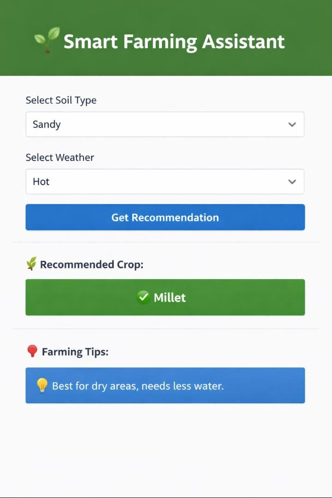

# 🌱 Smart Farming Assistant

## 📌 Problem Statement
Farmers face difficulty in selecting the right crops based on soil and weather conditions.

## 💡 Solution
This project helps farmers by suggesting suitable crops using soil type and weather data.

## 🛠️ Technologies Used
- Python
- Streamlit
- Pandas

## 🚀 Features
- Crop recommendation system
- Simple and user-friendly interface
- Fast results

## ▶️ How to Run
1. Install dependencies:
   pip install -r requirements.txt

2. Run the application:
   streamlit run Farmingapp.py

## 📷 Output Screenshot

## 📚 What I Learned
- Streamlit app development
- Real-world problem solving
- Data handling using Pandas
